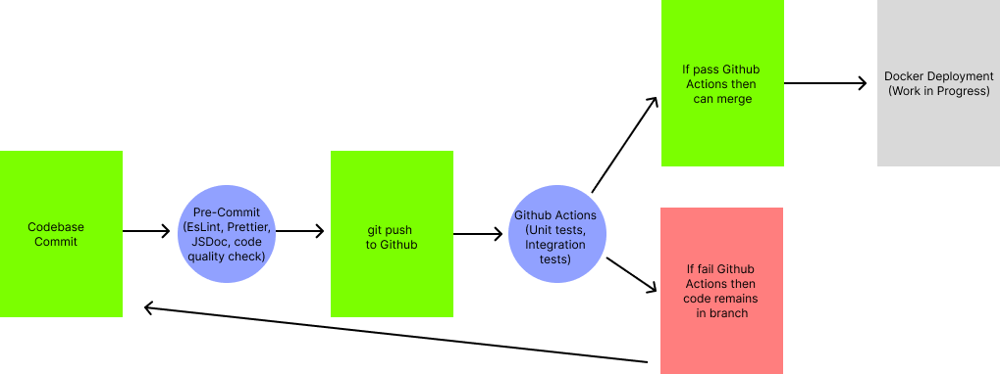

# Overall Pipeline Status: 
Our pipeline is mostly functional, and contains at least the framework for every part to run. We currently have a decent amount of tests, and all the code checks and Github actions are functional. All of the automation mentioned in the assignment have been completed as well. Docker development is also working for the development level, just not production quality yet. 

# Functional

## Feature 1 — Code Linting
We used Eslint to do code linting, and this feature is fully implemented. To run eslint after a commit, you don't have to do anything since it is fully automated to run through husky. It can also be manually run via "lint:fix". Additionally, a filter for files in the node_modules, specs, and other non relevant folders has been added so linting doesn't affect those files.  

## Feature 3 — Code Quality
Our code quality check is done with codeclimate on Github, and it runs automatically and is fully implemented.

## Feature 2 — Code Styling
The code styling is done by es.prettier, and is also fully implemented and automated. This command is done by "format", and is implemented by Husky calling a script on commit.

## Feature 3 — Document Generation
Our document generation is done via JSDoc on Husky, and is fully implemented. It is automated to run on a commit, and can also be run manually with "docs". There's a filter for only ts and js files outside of the non relevant folders will get document generation, while for html files they need Javascript headers to have JSDoc work.  

## Feature 4 — Github Actions
Our Github actions pipeline is fully functional and has multiple tests already existing. On a new commit, it automatically runs and if the tests pass the commit is mergable. Tests are run using Jest at the moment. 

### Unit Tests
We currently have 7 unit tests for the backend, testing functionality and security of the committed backend. We have a branch in progress for writing more unit tests as well. 

## Feature 5 — Docker (Development)
On Github actions, there already exists a Docker build for our frontend and backend on commit. Environmental variables are standardized and there's a Postgres check to start only when database is running. It is functional and implemented with Buildx and Prisma. We are currently working on making it fully functional. Can be ran locally via "docker compose up --build". 

### Deployment
Our Docker can deploy the app via monorepo. Initialize Docker with Docker compose up --build, then connect to the frontend host http://localhost:5173, backend API: http://localhost:3001, postgres: localhost:5432. We've achieved a running MVP of the app where the user can navigate through tabs and see from student and instructor view, look at activity, and add posts. Stop the server and deployment with Docker compose down.

---

# In-Progress

## Feature 1 — Docker (Production)
There are some elements of Docker that are not done yet. This is the production part of Docker. 

## Feature 2 — Tests
Though tests do exist already on Github actions, there isn't rigorous tests for integration and end-to-end and UI. Some security tests exist but there's still potential vulnerabilities at the moment.

### End-to-End Tests
We're currently unsure on how to implement end-to-end tests with the app. Since it is an application with a backend, we will have to somehow simulate use actions, check if backend is updated corrected, and check UI or other outputs.

### UI Tests
We currently don't have tests for UI, though we're planning on using something like Cypress or Puppeteer to do this.

### Security Tests
There exist some basic checks for security in the unit tests, but defenses for hacking attempts such as SQL injection might be needed.

### Integration Tests
Similar to end-to-end though easier to implement. We will likely start this once more app functionality is achieved. 

## Feature 3 - AWS Deployment
We plan to use AWS to deploy a database that is always up later on, instead of running on local. Will likely begin work on this next sprint (Sprint 3)