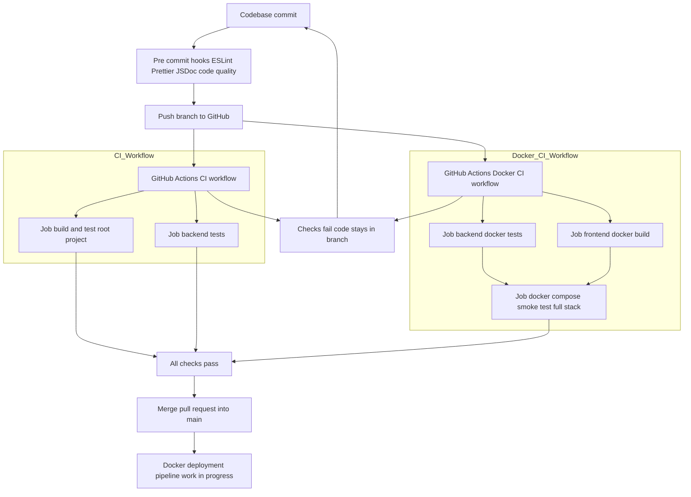

```mermaid
graph TD

  C1[Codebase commit] --> C2[Pre commit hooks ESLint Prettier JSDoc code quality]
  C2 --> C3[Push branch to GitHub]

  %% GitHub Actions workflows
  C3 --> W1[GitHub Actions CI workflow]
  C3 --> W2[GitHub Actions Docker CI workflow]

  %% CI workflow jobs
  subgraph CI_Workflow
    W1 --> J1[Job build and test root project]
    W1 --> J2[Job backend tests]
  end

  %% Docker CI workflow jobs
  subgraph Docker_CI_Workflow
    W2 --> D1[Job backend docker tests]
    W2 --> D2[Job frontend docker build]
    D1 --> D3[Job docker compose smoke test full stack]
    D2 --> D3
  end

  %% Outcomes
  J1 --> S1[All checks pass]
  J2 --> S1
  D3 --> S1

  S1 --> M1[Merge pull request into main]
  M1 --> DEP[Docker deployment pipeline work in progress]

  %% Failure path
  W1 --> F1[Checks fail code stays in branch]
  W2 --> F1
  F1 --> C1

```